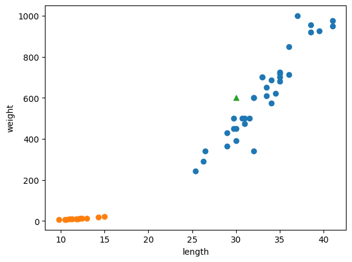

마켓과 머신러닝
===
목표
---
가장 간단한 머신러닝 알고리즘 중 하나인 k-최근접 이웃을 사용하여   
2개의 종류를 분류하는 머신러닝 모델을 훈련합니다.   

과정
---------------------
### 1. 도미 및 빙어 데이터 준비
```python
bream_length = [25.4, 26.3, 26.5, 29.0, 29.0, 29.7, 29.7, 30.0, 30.0, 30.7, 31.0, 31.0, 
                31.5, 32.0, 32.0, 32.0, 33.0, 33.0, 33.5, 33.5, 34.0, 34.0, 34.5, 35.0, 
                35.0, 35.0, 35.0, 36.0, 36.0, 37.0, 38.5, 38.5, 39.5, 41.0, 41.0]
bream_weight = [242.0, 290.0, 340.0, 363.0, 430.0, 450.0, 500.0, 390.0, 450.0, 500.0, 475.0, 500.0, 
                500.0, 340.0, 600.0, 600.0, 700.0, 700.0, 610.0, 650.0, 575.0, 685.0, 620.0, 680.0, 
                700.0, 725.0, 720.0, 714.0, 850.0, 1000.0, 920.0, 955.0, 925.0, 975.0, 950.0]

smelt_length = [9.8, 10.5, 10.6, 11.0, 11.2, 11.3, 11.8, 11.8, 12.0, 12.2, 12.4, 13.0, 14.3, 15.0]
smelt_weight = [6.7, 7.5, 7.0, 9.7, 9.8, 8.7, 10.0, 9.9, 9.8, 12.2, 13.4, 12.2, 19.7, 19.9]
```
### 2. 산점도 그리기
```python
import matplotlib.pyplot as plt # matplotlib의 pyplot 함수를 plt로 줄여서 사용

plt.scatter(bream_length, bream_weight)
plt.scatter(smelt_length, smelt_weight)
plt.xlabel('length')
plt.ylabel('weight')
plt.show()
```

### 3. 규칙 생성
```python
length = bream_length + smelt_length
weight = bream_weight + smelt_weight

fish_data = [[l, w] for l, w in zip(length, weight)]

fish_target = [1]*35 + [0]*14
```
### 4. 훈련
```python
from sklearn.neighbors import KNeighborsClassifier

kn = KNeighborsClassifier()
kn.fit(fish_data, fish_target)
kn.score(fish_data, fish_target)
```
> $accuracy : 1.0$
### 5. k-최근접 이웃 알고리즘
```python
kn.predict([[30, 600]])
```
> $predictive : 1$
### 6. 산점도 그리기
```python
plt.scatter(bream_length, bream_weight)
plt.scatter(smelt_length, smelt_weight)
plt.scatter(30, 600, marker='^')
plt.xlabel('length')
plt.ylabel('weight')
plt.show()
```


배운점
---
R이랑 비슷하지만 구글코랩을 통해 환경설정을 안해줘도 되는점이 간편했다.   
하지만 이것을 통해 어떻게 어플리케이션을 개발할 수 있을진 공부를 진행하면서 고민 해 봐야 할 것 같다.   
