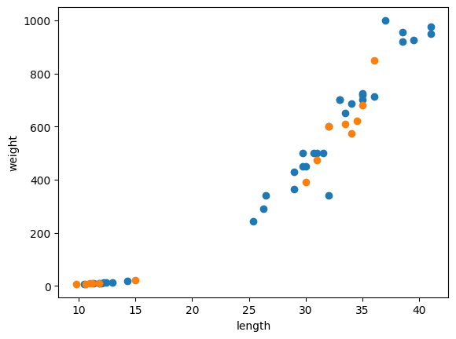

훈련 세트와 테스트 세트
===
목표
---
지도 학습과 비지도 학습의 차이를 배웁니다.   
모델을 훈련시키는 훈련세트와 모델을 평가하기 위한 테스트 세트로 데이터를 나눠서 학습해 봅니다.

과정
---------------------
### 1. 샘플 준비
```python
fish_length = [25.4, 26.3, 26.5, 29.0, 29.0, 29.7, 29.7, 30.0, 30.0, 30.7, 31.0, 31.0, 
                31.5, 32.0, 32.0, 32.0, 33.0, 33.0, 33.5, 33.5, 34.0, 34.0, 34.5, 35.0, 
                35.0, 35.0, 35.0, 36.0, 36.0, 37.0, 38.5, 38.5, 39.5, 41.0, 41.0, 9.8, 
                10.5, 10.6, 11.0, 11.2, 11.3, 11.8, 11.8, 12.0, 12.2, 12.4, 13.0, 14.3, 15.0]
fish_weight = [242.0, 290.0, 340.0, 363.0, 430.0, 450.0, 500.0, 390.0, 450.0, 500.0, 475.0, 500.0, 
                500.0, 340.0, 600.0, 600.0, 700.0, 700.0, 610.0, 650.0, 575.0, 685.0, 620.0, 680.0, 
                700.0, 725.0, 720.0, 714.0, 850.0, 1000.0, 920.0, 955.0, 925.0, 975.0, 950.0, 6.7, 
                7.5, 7.0, 9.7, 9.8, 8.7, 10.0, 9.9, 9.8, 12.2, 13.4, 12.2, 19.7, 19.9]

fish_data = [[l, w] for l, w in zip(fish_length, fish_weight)]
fish_target = [1]*35 + [0]*14
```
### 2. 세트 훈련 및 테스트 성능 측정
```python
from sklearn.neighbors import KNeighborsClassifier

kn = KNeighborsClassifier()

train_input = fish_data[:35]
train_target = fish_target[:35]
test_input = fish_data[35:]
test_target = fish_target[35:]

kn.fit(train_input, train_target)
kn.score(test_input, test_target)
```
> $score : 0.0$
> > **샘플링 편향**$^{SamplingBias}$
### 3. 랜덤 인덱스 생성
```python
import numpy as np # 고차원 배열을 손쉽게 만들고 간편하게 조작하는 라이브러리 (넘파이)

input_arr = np.array(fish_data)
target_arr = np.array(fish_target)

print(input_arr.shape) # 배열의 (샘플 수, 특성 수)를 알려주는 속성 (shape)

np.random.seed(42)
idx = np.arange(49)
np.random.shuffle(idx)
```
> $shape:(49,2)$
### 4. 훈련 세트와 테스트 세트 재생성
```python
train_input = input_arr[idx[:35]]
train_target = target_arr[idx[:35]]
test_input = input_arr[idx[35:]]
test_target = target_arr[idx[35:]]
```
### 5. 산점도 그리기
```python
import matplotlib.pyplot as plt

plt.scatter(train_input[:,0], train_input[:,1])
plt.scatter(test_input[:,0], test_input[:,1])
plt.xlabel('length')
plt.ylabel('weight')
plt.show()
```

### 6. 훈련 및 성능 측정
```python
kn.fit(train_input, train_target)
print(kn.score(test_input, test_target))
print(kn.predict(test_input))
print(test_target)
```
> $score:1.0$

배운점
---
지도 학습 모델에 대한 평가를 하려면 **테스트 세트**가 필요하다.   
그 과정 중 **샘플링 편향**에 주의해야 한다.   
사이킷런 모델의 입력과 출력은 모두 **넘파이 배열**이다.   
