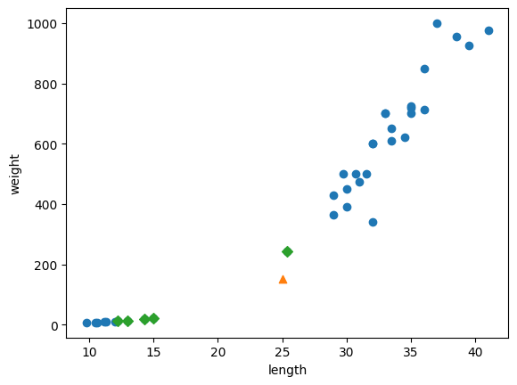
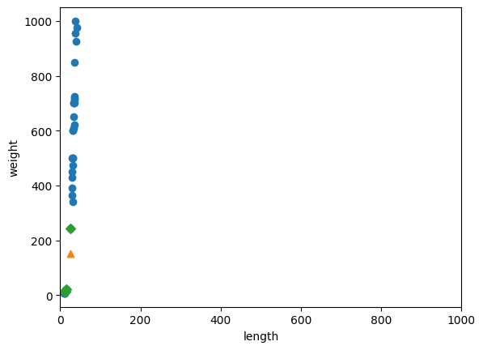

데이터 전처리
===
목표
---
올바른 결과 도출을 위해서 데이터를 사용하기 전에 데이터 전처리 과정을 거칩니다.   
전처리 과정을 거친 데이터로 훈련했을 때의 차이를 알고 표준점수로 특성의 스케일을 변환하는 방법을 배웁니다.

과정
---------------------
### 1. 넘파이로 데이터 준비하기
```python
fish_length = [25.4, 26.3, 26.5, 29.0, 29.0, 29.7, 29.7, 30.0, 30.0, 30.7, 31.0, 31.0, 
                31.5, 32.0, 32.0, 32.0, 33.0, 33.0, 33.5, 33.5, 34.0, 34.0, 34.5, 35.0, 
                35.0, 35.0, 35.0, 36.0, 36.0, 37.0, 38.5, 38.5, 39.5, 41.0, 41.0, 9.8, 
                10.5, 10.6, 11.0, 11.2, 11.3, 11.8, 11.8, 12.0, 12.2, 12.4, 13.0, 14.3, 15.0]
fish_weight = [242.0, 290.0, 340.0, 363.0, 430.0, 450.0, 500.0, 390.0, 450.0, 500.0, 475.0, 500.0, 
                500.0, 340.0, 600.0, 600.0, 700.0, 700.0, 610.0, 650.0, 575.0, 685.0, 620.0, 680.0, 
                700.0, 725.0, 720.0, 714.0, 850.0, 1000.0, 920.0, 955.0, 925.0, 975.0, 950.0, 6.7, 
                7.5, 7.0, 9.7, 9.8, 8.7, 10.0, 9.9, 9.8, 12.2, 13.4, 12.2, 19.7, 19.9]

import numpy as np

fish_data = np.column_stack((fish_length, fish_weight))

fish_target = np.concatenate((np.ones(35), np.zeros(14)))
```
### 2. 사이킷런으로 훈련 세트와 테스트 세트 나누기
```python
from sklearn.model_selection import train_test_split

train_input, test_input, train_target, test_target = train_test_split(fish_data, fish_target, random_state=42) # 기본값 25%

#샘플링 편향이 있을 수 있으니 꼭 확인.
print(test_target) # 도미(1) 10마리, 빙어(0) 3마리 (빙어가 살짝 많음)

#매개변수 stratify에 target 데이터를 전달
train_input, test_input, train_target, test_target = train_test_split(fish_data, fish_target, stratify=fish_target, random_state=42)

print(test_target)
```
> $[1.\ 0.\ 0.\ 0.\ 1.\ 1.\ 1.\ 1.\ 1.\ 1.\ 1.\ 1.\ 1.]$   
> $[0.\ 0.\ 1.\ 0.\ 1.\ 0.\ 1.\ 1.\ 1.\ 1.\ 1.\ 1.\ 1.]$
### 3. 수상한 도미 한 마리
```python
from sklearn.neighbors import KNeighborsClassifier

kn = KNeighborsClassifier()
kn.fit(train_input, train_target) # k-최근접 이웃 훈련
print(kn.score(test_input, test_target)) # 테스트

# 임의의 도미 데이터 예측
print(kn.predict([[25, 150]]))
```
> $score:1.0$   
> $predict:[0.]$ //빙어(0)
### 4. 산점도 그리기
```python
import matplotlib.pyplot as plt

plt.scatter(train_input[:,0], train_input[:,1])
plt.scatter(25, 150, marker='^')
plt.xlabel('length')
plt.ylabel('weight')
plt.show()
```

> marker='^'으로 표기된 임의의 데이터는 도미에 가깝다.   
> 하지만 결과는 빙어로 나왔다. **Why?**
```python
#넘파이 배열 인덱싱
#param으로 주어진 샘플의 가장 가까운 이웃을 찾아주는 메소드 ".kneighbors()"
distance, indexes = kn.kneighbors([[25, 150]]) #KNeighborsClassifier의 이웃 개수 n_neighbors의 기본값은 5

plt.scatter(train_input[:,0], train_input[:,1])
plt.scatter(25, 150, marker='^')
plt.scatter(train_input[indexes,0], train_input[indexes,1], marker='D')
plt.xlabel('length')
plt.ylabel('weight')
plt.show()
```

> 삼각형 샘플에 가장 가까운 5개의 샘플 중 4개가 빙어   
> > k-최근접 이웃은 인접한 샘플 중에서 다수인 클래스를 예측으로 사용하기에 이전 예측 결과가 빙어 였던 것
### 5. 기준을 맞춰라
> 샘플의 특성인 길이와 무게의 **스케일**$^{scale}$이 달라 벌어진 일
```python
plt.scatter(train_input[:,0], train_input[:,1])
plt.scatter(25, 150, marker='^')
plt.scatter(train_input[indexes,0], train_input[indexes,1], marker='D')
plt.xlim((0, 1000)) #x축의 범위를 y값과 동일하게 0~1000으로 설정
plt.xlabel('length')
plt.ylabel('weight')
plt.show()
```

> 데이터를 표현하는 기준이 다르면 올바른 예측이 불가능   
> 거리 기반 알고리즘의 경우 각 특성간의 기준을 맞춰주어야 제대로 사용 가능   
> > **데이터 전처리**
### 6. 표준점수와 표준편차
> **분산** : 데이터에서 평균을 뺀 값을 모두 제곱한 다음 평균을 내어 구한다.   
> **표준편차** : 분산의 제곱근으로 데이터가 분산된 정도를 나타낸다.   
> **표준점수** : 각 데이터가 원점에서 몇 표준편차만큼 떨어져 있는지를 나타내는 값.
```python
mean = np.mean(train_input, axis = 0) #평균을 계산 하는 함수
std = np.std(train_input, axis = 0) #표준편차를 계산 하는 함수

#axis는 배열의 축이지만 차원의 개념으로 이해하면 쉽다.
#1차원은 선, 2차원은 면, 3차원은 도형이듯이 axis는 그 선을 축으로 표현한다.
#train_input은 [[길이1,무게1].[길이2,무게2]] 이런 식으로 정의가 되어있는데
#axis가 0이므로 [길이1,무게1] -> [길이2,무게2] 순서로 진행 (row 단위)

print(mean, std) #데이터의 평균과 각 데이터간의 분산된 정도

train_scaled = (train_input-mean)/std #표준점수
```
> $mean:[\ 27.29722222\ 454.09722222]$   
> $std:[\  9.98244253\ 323.29893931]$
> > train_scaled를 계산 할 때 numpy는 스스로 column끼리 계산해준다.
> > > **브로드캐스팅**$^{broadcasting}$
### 7. 전처리 데이터로 모델 훈련하기
```python
#테스트 모델 표준점수
test_scaled = (test_input - mean) / std

kn.fit(train_scaled, train_target)
print(kn.score(test_scaled, test_target))

#예측 샘플 표준점수
new = ([25, 150] - mean) / std

print(kn.predict([new]))
```
> $score:1.0$   
> $predict:[1.]$ //도미(1)
### 8. 산점도 그리기
```python
distance, indexes = kn.kneighbors([new])
plt.scatter(train_scaled[:,0], train_scaled[:,1])
plt.scatter(new[0], new[1], marker='^')
plt.scatter(train_scaled[indexes,0], train_scaled[indexes,1], marker='D')
plt.xlabel('length')
plt.ylabel('weight')
plt.show()
```


핵심 포인트
---
- **데이터 전처리**는 머신러닝 모델에 훈련 데이터를 주입하기 전에 가공하는 단계
- **표준점수**는 훈련 세트의 스케일을 바꾸는 대표적인 방법 중 하나
  - 표준점수를 얻으려면 특성의 평균을 빼고 표준편차로 나눕니다.
  - 반드시 훈련세트의 평균과 표준편차로 테스트 세트를 바꿔야 합니다.
- **브로드캐스팅**은 크기가 다른 numpy 배열에서 자동으로 사칙 연산을 모든 행이나 열로 확장하여 수행하는 기능

배운점
---
1. 큰 차이를 보이는 scale을 표준화 하는 방법으로 **표준점수**를 사용하는 법
2. numpy배열은 알아서 column과 low를 계산 한다는 점
