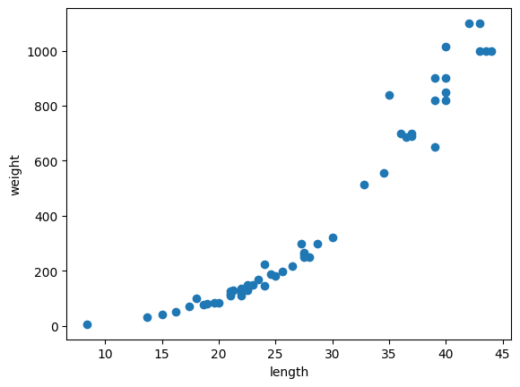

k-최근접 이웃 회귀
===
목표
---
지도 학습의 한 종류인 회귀 문제를 이해하고,   
k-최근접 이웃 알고리즘을 사용해 농어의 무게를 예측.

과정
---------------------
### 1. 데이터 준비
```python
import numpy as np

# 농어의 길이
perch_length = np.array([8.4, 13.7, 15.0, 16.2, 17.4, 18.0, 18.7, 19.0, 19.6, 20.0, 21.0,
       21.0, 21.0, 21.3, 22.0, 22.0, 22.0, 22.0, 22.0, 22.5, 22.5, 22.7,
       23.0, 23.5, 24.0, 24.0, 24.6, 25.0, 25.6, 26.5, 27.3, 27.5, 27.5,
       27.5, 28.0, 28.7, 30.0, 32.8, 34.5, 35.0, 36.5, 36.0, 37.0, 37.0,
       39.0, 39.0, 39.0, 40.0, 40.0, 40.0, 40.0, 42.0, 43.0, 43.0, 43.5,
       44.0])

# 농어의 무게
perch_weight = np.array([5.9, 32.0, 40.0, 51.5, 70.0, 100.0, 78.0, 80.0, 85.0, 85.0, 110.0,
       115.0, 125.0, 130.0, 120.0, 120.0, 130.0, 135.0, 110.0, 130.0,
       150.0, 145.0, 150.0, 170.0, 225.0, 145.0, 188.0, 180.0, 197.0,
       218.0, 300.0, 260.0, 265.0, 250.0, 250.0, 300.0, 320.0, 514.0,
       556.0, 840.0, 685.0, 700.0, 700.0, 690.0, 900.0, 650.0, 820.0,
       850.0, 900.0, 1015.0, 820.0, 1100.0, 1000.0, 1100.0, 1000.0,
       1000.0])
```
### 2. 산점도 그리기
```python
import matplotlib.pyplot as plt

plt.scatter(perch_length, perch_weight)
plt.xlabel('length')
plt.ylabel('weight')
plt.show()
```

### 3. 사이킷런으로 훈련 세트와 테스트 세트 나누기
```python
from sklearn.model_selection import train_test_split

# train_test_split 을 통해 테스트 세트와 훈련 세트를 나눠 준다.
train_input, test_input, train_target, test_target = train_test_split(perch_length, perch_weight, random_state=42)
# 사이킷런 모델은 2차원 배열이므로 reshape를 통해 1차원 배열을 2차원 배열로 만들어주는 과정
train_input = train_input.reshape(-1, 1) # (원소 수, 특성 수)
test_input = test_input.reshape(-1, 1) # -1을 통해 원소 개수를 자동으로 지정해 줄 수 있다
print(train_input.shape, test_input.shape)
```
> (42, 1) (14, 1)
### 4. 결정계수(R²)
```python
from sklearn.neighbors import KNeighborsRegressor

knr = KNeighborsRegressor()

# k-최근접 이웃 회귀 모델을 훈련
knr.fit(train_input, train_target)
print(knr.score(test_input, test_target))

from sklearn.metrics import mean_absolute_error

# 테스트 세트에 대한 예측을 만든다
test_prediction = knr.predict(test_input)

# 테스트 세트에 대한 평균 절댓값 오차를 계산
mae = mean_absolute_error(test_target, test_prediction)
print(mae)
```
> $score:0.992809406101064$
> $mae:19.157142857142862$
### 5. 과대적합 vs 과소적합

### 6.

핵심 포인트
---

배운점
---
